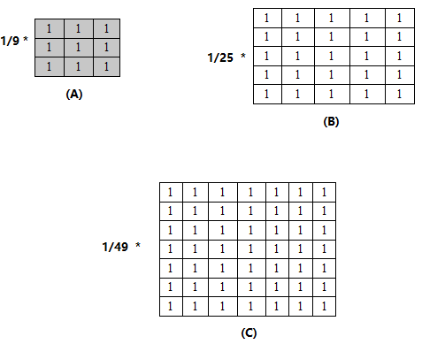
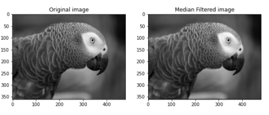
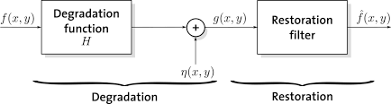
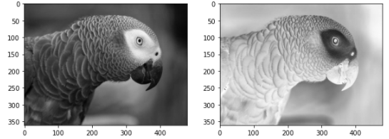
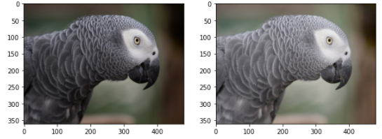
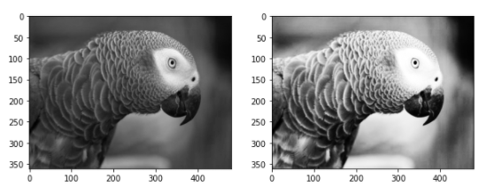

Digital Image Processing and Application

**Motivation:**

Digital image processing is the use of computer algorithms to perform image processing on digital images. As a subcategory or field of digital signal processing, digital image processing has many advantages over analog image processing. It allows a much wider range of algorithms to be applied to the input data and can avoid problems such as the build-up of noise and signal distortion during processing. Since images are defined over two dimensions (perhaps more) digital image processing may be modeled in the form of multidimensional systems.

**Introduction：** 

Many of the techniques of digital image processing, or digital picture processing as it often was called, were developed in the 1960s at the Jet Propulsion Laboratory, Massachusetts Institute of Technology, Bell Laboratories, University of Maryland, and a few other research facilities, with application to satellite imagery, wire-photo standards conversion, medical imaging, videophone, character recognition, and photograph enhancement. The cost of processing was fairly high, however, with the computing equipment of that era. That changed in the 1970s, when digital image processing proliferated as cheaper computers and dedicated hardware became available. Images then could be processed in real time, for some dedicated problems such as television standards conversion. As general-purpose computers became faster, they started to take over the role of dedicated hardware for all but the most specialized and computer-intensive operations. With the fast computers and signal processors available in the 2000s, digital image processing has become the most common form of image processing and generally, is used because it is not only the most versatile method, but also the cheapest.

Digital image processing technology for medical applications was inducted into the Space Foundation Space Technology Hall of Fame in 1994.

In 2002 Raanan Fattel, introduced Gradient domain image processing, a new way to process images in which the differences between pixels are manipulated rather than the pixel values themselves.

**1.1Application of Digital Image Processing**

There is many fileds that can use digital image processing for example:

Fingerprint recognition

Traffic Management

Remote Sensing

Military

Medical Imaging

Transportation

Industrial Inspection/Quality Control

Digital Camera Image

Entertainment 

Morphology

Computer vision

Augmented Reality

Non-Photorealistic rendering

And there are many field application can use image processing.

1. **Image Sample and Quantization**

In order to become suitable for digital processing, an image function f(x, y) must be digitized both spatially and in amplitude. Typically, a frame grabber or digitizer is used to sample and quantize the analogue video signal. Hence in order to create an image which is digital, we need to covert continuous data into digital form. There are two steps in which it is done:

Sampling

Quantization

The sampling rate determines the spatial resolution of the digitized image, while the quantization level determines the number of grey levels in the digitized image. A magnitude of the sampled image is expressed as a digital value in image processing. The transition between continuous values of the image function and its digital equivalent is called quantization.

The number of quantization levels should be high enough for human perception of fine shading details in the image. The occurrence of false contours is the main problem in image which has been quantized with insufficient brightness levels.

**2.2 Video & Image Quantization**

Digital image quantization is the process of determining which parts of an image can be discarded or consolidated with minimal subjective loss. Image quantization is inherently loss however (i.e. the image quality is reduced due to the loss of some information).Color quantization is a method of reducing the number of colors required to represent an image. For example, converting a photograph to GIF format requires the number of colors to be reduced to 256.In images scanners; quantization is the process of forcing similar gray levels to the same level as a result of limited tonal resolution. Most often apparent in the shadow areas of scanned images.

1. **Image Enhancement**

In computer graphics, the process of improving the quality of a digitally stored image by manipulating the image with software. It is quite easy, for example, to make an image lighter or darker, or to increase or decrease contrast. Advanced image enhancement software also supports many filters for altering images in various ways. Programs specialized for image enhancement is sometimes called image editors.

In short image enhancement refers to the use of algorithms to produce better quality images either by suppressing noise or increasing image contrast.

1. **Image Histogram**

An image histogram is a type of histogram that acts as a graphical representation of the tonal distribution in a digital image. It plots the number of pixels for each tonal value. By looking at the histogram for a specific image a viewer will be able to judge the entire tonal distribution at a glance.

Image histograms are present on many modern [digital cameras](http://en.wikipedia.org/wiki/Digital_cameras "Digital cameras"). Photographers can use them as an aid to show the distribution of tones captured, and whether image detail has been lost to blown-out highlights or blacked-out shadows. It is a simple graph that displays where all of the brightness levels contained in the scene are found, from the darkest to the brightest. These values are arrayed across the bottom of the graph from left (darkest) to right (brightest). 

1. **The spatial filter**

**4.1 Spatial Filtering - background**

The use of spatial masks for image processing usually is called spatial filtering (as opposed to frequency domain filtering using the Fourier transform) and the masks themselves are called spatial filters.

Now we consider linear and non-linear spatial filters for image enhancement.

Liner filters are based on concept that the transfer function and impulse function of a linear system are inverse Fourier Transform of each other. 

Low-pass filters attenuate or eliminate high-frequency components in the Fourier domain while leaving low frequencies untouched. High-frequency components characterize edges and other sharp details in an image, so the net effect of low-pass filtering is image blurring.

High-pass filters attenuate or eliminate low-frequency components. Low-frequency components are responsible for the slowly varying characteristics of an image, such as overall contrast and average intensity, and the net result of high-pass filtering is a reduction of these features and a correspondingly apparent sharpening of edges and other sharp details. 

Band-pass filtering removes selected frequency regions between low and high frequencies. These filters are used for image restoration and are seldom of interest in image enhancement.

**Figure 1. Top: Cross sections of basic shapes for circularly symmetric frequency domain filters. Bottom: cross sections of corresponding spatial domain filters**

The above figure 1 shows the cross sections of circularly symmetric low pass, high pass, and band pass filters in the frequency domain and their corresponding spatial filters. The shapes in the bottom row are used as guidelines for specifying linear spatial filters. Regardless of the type of linear filter used, however, the basic approach is to sum products between the mask coefficients and the intensities of the pixels under the mask at a specific location in the image. 

**Figure 2 below shows the general 3 x 3 mask**.  

**Figure 2. A 3 x 3 mask with arbitrary coefficients**

Denoting the gray-level of pixels under the mask at any location by z1, z2, …., z9, the response of a linear mask is

R = w1 z1 +  w2z2 + …. w9 z9 -------- (Equation 1)

If the center of the mask is at location (x, y) in the image, the gray level of pixel located at (x,y) is replaced by R. The mask is then moved to the next pixel location in the image and the process is repeated. This continues till all pixel locations have been covered. The value of R is computed by using partial neighborhoods for pixels that are located in the border of the image. Also, usual practice is to create a new image to store the values of R, instead of changing pixels values in place. This practice avoids using gray-level that have been altered as a result of an earlier application of this equation.

` `**4.2 Smoothing Filters**

Smoothing filters are used for blurring and for noise reduction. Blurring is used in preprocessing steps, such as removal of small details from an image prior to (large) object extraction and bridging of small gaps in lines or curves. Noise reduction can be accomplished by blurring with a linear filter and also by nonlinear filtering.

**4.2.1Lowpass Spatial Filtering**

The shape of impulse response needed to implement a low pass (smoothing) spatial filter indicates that the filter has to have all positive coefficients (as shown in Fig 1(a)). Although the spatial filter shape shown in Fig 1(a) could be modeled by, say, a sampled Gaussian function, the key requirement is that all the coefficients be positive. 

For a 3 x 3 spatial filter, the simplest arrangement would be a mask in which all coefficients have a value of 1. However from equation 1, the response would then be the sum of gray levels for nine pixels, which would cause R to be out of the valid gray-level range. The solution is to scale the sum by dividing R by 9. 

**Figure 3. Spatial Low pass filters of various sizes**

Figure 3 shows an example of denoising by successively larger smoothing masks.

**Figure 4. denoidsing using filtering with a mask of size n x n, n = 3, 5, 7, 15, 25.** 

**4.2.2 Median Filtering**

If the objective is to achieve noise reduction rather than blurring, an alternative approach is to use median filters. That is, the gray-level of each pixel is replaced by the median of the gray levels in a neighborhood of that pixel, instead of by the average. This method is particularly effective when the noise pattern consists of strong, spike like components and the characteristics to be preserved is edge sharpness.

**Figure 3. Example on median filtering.**

**4.3 Sharpening Filters**

Sharpening filters are used to highlight fine detail in an image or to enhance detail that has been blurred. Use of image sharpening vary and include applications ranging from electronic printing and medical imaging to industrial inspection and autonomous target detection in smart weapons.

**4.3.1 Basic High pass Spatial Filtering**

The shape of the impulse response needed to implement a high pass (sharpening) spatial filter indicates that the filter should have positive coefficients near its center and negative coefficients in the outer periphery For a 3 x 3 masks, choosing a positive value in the center location with negative coefficients in the rest of the mask meets this condition.

**Figure below (fig 6) shows the classic implementation of a 3 x 3 sharpening filter.**   

|1/9 x||
| :-: | :-: |

|-1|-1|-1|
| :-: | :-: | :-: |
|-1|8|-1|
|-1|-1|-1|

|||
| :-: | :-: |

**Figure 6. A basic high pass spatial filter**

processing applications is the gradient.

1. **Image Restoration**

The purpose of image restoration is to restore a degraded/distorted image to its original content and quality. In contrast to image enhancement, image restoration assumes a degradation model that is known or can be estimated. The original content and quality is not good looking Image restoration recovers images from distortions to its original image and is largely an objective process whiles image enhancement process image so that the result is more suitable for a specific application and is largely a subjective process. 

**Figure 9 A model of image degradation/restoration process**

1. **Characteristics noises (noise types)**

**7.1 Gaussian noise**

The standard model of amplifier noise is additive, Gaussian, independent at each [pixel] and independent of the signal intensity, caused primarily by [Johnson–Nyquist noise](http://en.wikipedia.org/wiki/Johnson%E2%80%93Nyquist_noise "Johnson–Nyquist noise") (thermal noise), including that which comes from the reset noise of capacitors ("KTC noise").In color cameras where more amplification is used in the blue color channel than in the green or red channel, there can be more noise in the blue channel.

Amplifier noise is a major part of the "read noise" of an image sensor, that is, of the constant noise level in dark areas of the image.

**7.2 Salt-and-pepper noise**

[Fat-tail distributed](http://en.wikipedia.org/wiki/Fat_tail "Fat tail") or "impulsive" noise is sometimes called salt-and-pepper noise or spike noise. An image containing salt-and-pepper noise will have dark pixels in bright regions and bright pixels in dark regions. This type of noise can be caused by dead [pixels][pixel], [analog-to-digital converter](http://en.wikipedia.org/wiki/Analog-to-digital_converter "Analog-to-digital converter") errors; bit errors in transmission, etc. This can be eliminated in large part by using [dark frame subtraction](http://en.wikipedia.org/wiki/Dark_frame_subtraction "Dark frame subtraction") and by interpolating around dark/bright pixels.

**7.3 Shot noise**

The dominant noise in the lighter parts of an image from an [image sensor] is typically that caused by statistical quantum fluctuations, that is, variation in the number of photons sensed at a given exposure level; this noise is known as photon [shot noise]. Shot noise has a [root-mean-square](http://en.wikipedia.org/wiki/Root-mean-square "Root-mean-square") value proportional to the square root of the image intensity, and the noises at different pixels are independent of one another. Shot noise follows a [Poisson distribution], which is usually not very different from Gaussian.

In addition to photon shot noise, there can be additional shot noise from the dark leakage current in the image sensor; this noise is sometimes known as "dark shot noise" or "dark-current shot noise". Dark current is greatest at "hot pixels" within the image sensor; the variable dark charge of normal and hot pixels can be subtracted off (using "dark frame subtraction"), leaving only the shot noise, or random component, of the leakage; if dark-frame subtraction is not done, or if the exposure time is long enough that the hot pixel charge exceeds the linear charge capacity, the noise will be more than just shot noise, and hot pixels appear as salt-and-pepper noise.

**7.4 Quantization noise (uniform noise)**

The noise caused by [quantizing](http://en.wikipedia.org/wiki/Quantization_%28signal_processing%29 "Quantization (signal processing)") the pixels of a sensed image to a number of discrete levels is known as [quantization](http://en.wikipedia.org/wiki/Quantization_%28image_processing%29 "Quantization (image processing)") noise; it has an approximately [uniform distribution](http://en.wikipedia.org/wiki/Uniform_distribution_%28continuous%29 "Uniform distribution (continuous)"), and can be signal dependent, though it will be signal independent if other noise sources are big enough to cause [dithering](http://en.wikipedia.org/wiki/Dithering "Dithering"), or if dithering is explicitly applied. 

**7.5 Film grain**

The [grain](http://en.wikipedia.org/wiki/Film_grain "Film grain") of [photographic film](http://en.wikipedia.org/wiki/Photographic_film "Photographic film") is a signal-dependent noise, related to [shot noise]. That is, if film grains are uniformly distributed (equal number per area), and if each grain has an equal and independent probability of developing to a dark silver grain after absorbing [photons](http://en.wikipedia.org/wiki/Photon "Photon"), then the number of such dark grains in an area will be random with a [binomial distribution](http://en.wikipedia.org/wiki/Binomial_distribution "Binomial distribution"); in areas where the probability is low, this distribution will be close to the classic [Poisson distribution] of shot noise; nevertheless a simple [Gaussian distribution](http://en.wikipedia.org/wiki/Gaussian_distribution "Gaussian distribution") is often used as an accurate enough model.

Film grain is usually regarded as a nearly [isotropic](http://en.wikipedia.org/wiki/Isotropic "Isotropic") (non-oriented) noise source, and is made worse by the distribution of silver grains in the film also being random.

**7.6 Anisotropic noise**

Some noise sources show up with a significant orientation in images. For example, [image sensors][image sensor] are sometimes subject to row noise or column noise. In film, scratches are an example of anisotropic noise.

1. **Differences between false color image and pseudo -color image and their applications.**

A pseudo-color image is derived from a [gray-scale](http://en.wikipedia.org/wiki/Greyscale "Greyscale") image by mapping each [pixel] value to a color according to a table or function. A familiar example is the encoding of [altitude](http://en.wikipedia.org/wiki/Altitude "Altitude") using [hypsometric tints](http://en.wikipedia.org/wiki/Hypsometric_tints "Hypsometric tints") in physical [relief maps](http://en.wikipedia.org/wiki/Cartographic_relief_depiction "Cartographic relief depiction"), where negative values (below [sea level](http://en.wikipedia.org/wiki/Sea_level "Sea level")) are usually represented by shades of blue, and positive values by greens and browns. Pseudo-coloring can make some details more visible, by increasing the distance in [color space](http://en.wikipedia.org/wiki/Color_space "Color space") between successive gray levels. Pseudo-coloring can be used to store the results of image elaboration; that is, changing the colors in order to ease understanding the image. Alternatively, depending on the table or function used, pseudo-coloring may increase the information contents of the original image, for example adding geographic information, combining information obtained from infra-red or ultra-violet light, or [MRI](http://en.wikipedia.org/wiki/Magnetic_resonance_imaging "Magnetic resonance imaging") scans.

Pseudo-color images differ from false-color images in that they are made from only one original gray-scale image, rather than two or three.

False-color and pseudo-color images are frequently used for viewing satellite images, such as from [weather satellites](http://en.wikipedia.org/wiki/Weather_satellite "Weather satellite"), the [Hubble Space Telescope](http://en.wikipedia.org/wiki/Hubble_Space_Telescope "Hubble Space Telescope"), and the [Cassini-Huygens](http://en.wikipedia.org/wiki/Cassini-Huygens "Cassini-Huygens") [space probe](http://en.wikipedia.org/wiki/Space_probe "Space probe")'s images of the rings of [Saturn](http://en.wikipedia.org/wiki/Saturn "Saturn"). [Infrared cameras](http://en.wikipedia.org/wiki/Infrared_camera "Infrared camera") used for [thermal imaging](http://en.wikipedia.org/wiki/Thermal_imaging "Thermal imaging") often show their image in false colors. In the notes for a toolkit called GIPSY that might be used for this application area (written in 2001) it is said:

The True Color visual lacks the capability of Pseudo Color to modify the color representation of images after they have been put onto the display. In GIPSY this capability is used to offer the user a fast and convenient way to change contrast, brightness and colors of displayed images. In True Color this is not easily possible. There the image needs to be recalculated and reloaded.

The used term Pseudo Color refers to a pixel encoding category for [X11](http://en.wikipedia.org/wiki/X11 "X11") systems that represents pseudo color. This category is still present in the current implementation provided by [Xorg](http://en.wikipedia.org/wiki/Xorg "Xorg"). Even if hardware based 8 bit palletized modes might be a rather common bitness variant for the semiconductor based implementation (the most prominent ancestor is the IBM VGA graphics adapter) of pseudo-color modes still the principle is not at all limited to that depth. E.g. announcements for medical devices from 1999 report RAMDAC designs with 10 bit being fed with image data of 12 bit width using a 12-to-10-bit conversion table plus several other modes. 

However, in a false-color image the close correspondence between subject color and image color is altered. That can happen in many ways. For example, a [photographic negative](http://en.wikipedia.org/wiki/Negative_%28photography%29 "Negative (photography)") could be called a false-color image, since it shows the complementary colors of its subject. However, the term "false-color" is typically used to describe images whose colors represent measured intensities outside the [visible portion](http://en.wikipedia.org/wiki/Optical_spectrum "Optical spectrum") of the [electromagnetic spectrum](http://en.wikipedia.org/wiki/Electromagnetic_spectrum "Electromagnetic spectrum") (or outside the electromagnetic spectrum altogether).

More generally, false-color images can be generated by [digital image processing](http://en.wikipedia.org/wiki/Digital_image_processing "Digital image processing") techniques to represent up to three independent measurements over a two-dimensional map or image. For example, a [satellite](http://en.wikipedia.org/wiki/Satellite "Satellite") might capture average intensities in short ranges of the [ultraviolet](http://en.wikipedia.org/wiki/Ultraviolet "Ultraviolet") spectrum and the near infrared spectrum. These measurements can be combined with altitude information in such a way that blue represents ultraviolet, green represents altitude, and red represents infrared. Then a bright yellow pixel indicates a high-altitude object that emits or reflects infrared light but not ultraviolet light; a magenta pixel indicates a low-altitude object that emits or reflects both infrared and ultraviolet light; etc. Because human [visual perception](http://en.wikipedia.org/wiki/Visual_perception "Visual perception") is limited to three independent coordinates (Combination of Red, Green and Blue) at most three measurements can be depicted in such a way.

Furthermore, a true-color image of a subject is an image that appears to the human eye just like the original subject would: a green tree appears green in the image, a red apple red, a blue sky blue, etc. When applied to black-and-white images, true-color means that the perceived lightness of a subject is preserved in its depiction. Absolute true-color is impossible to achieve due to the differences between the chemistry of the display medium and the materials in the original scene.

Part two:

Develop a program for image enhancement processing in spatial domain which should include all basic transforms.

Answer:

Enhancement: to process an image so that the result is more suitable than the original image for a specific application.

Spatial Domain: Background

g(x,y)=T[f(x,y)]

f(x,y): input image, g(x,y): processed image

T: an operator

               Input (f)                   T              Output (g)

Enhancement approaches:

1\. Spatial domain

2\. Frequency domain

Enhancement in The Spatial Domain:

Spatial Domain: Point Processing

s=T(r)

r: gray-level at (x,y) in original image f(x,y)

s: gray-level at (x,y) in processed image g(x,y)

T is called gray-level transformation or mapping

`               `Input (f)                    T              Output (g)

Spatial domain techniques are techniques that operate directly on pixels.

Here we show some experiment of the image enhancement in the spatial domain.

1. **Experiment Code:**

1) Image Negative:

When we read an image to a variable using for example using Python, the variable stores the pixel values of the image. When we try to negatively transform an image, the brightest areas are transformed into the darkest and the darkest areas into the brightest. The negative transformation can be described by the expression 

S  = L-1-r where r is the initial intensity level and s is the final intensity level of a pixel. This produces a photographic negative.

**Figure10. Negative of the image (gray level image)**

1) Power-Law(gamma transformation):

Gamma adjustment is essential for the correct display of the images on the screen. Keeps the bleaching or darkening of images when viewed from different screens with different  settings.

**Figure 11. Image before and after gamma correction**

1) Bit Plane

`      `slicing the image at different planes (bit-planes) plays an important role in image processing. An application of this technique is data compression. In general, 8-bit per pixel images are processed. We can slice an image into the following bit-planes. Zero is the least significant bit (LSB) and 7 is the most significant bit (MSB). 

**Figure12. Bit-plane slicing**

1) Histogram Equalization:

Histogram Equalization is a computer image processing technique used to improve contrast in images. It accomplishes this by effectively spreading out the most frequent intensity values.

**Figure 13. histogram Equalization**

**Conclusion:** 

Using digital image processing is common in a image restoration and enhancement.

In the applied experiments it is evident that the techniques behind image enhancement are effective specially in some domains like medical imaging.
1

[pixel]: http://en.wikipedia.org/wiki/Pixel "Pixel"
[image sensor]: http://en.wikipedia.org/wiki/Image_sensor "Image sensor"
[shot noise]: http://en.wikipedia.org/wiki/Shot_noise "Shot noise"
[Poisson distribution]: http://en.wikipedia.org/wiki/Poisson_distribution "Poisson distribution"
